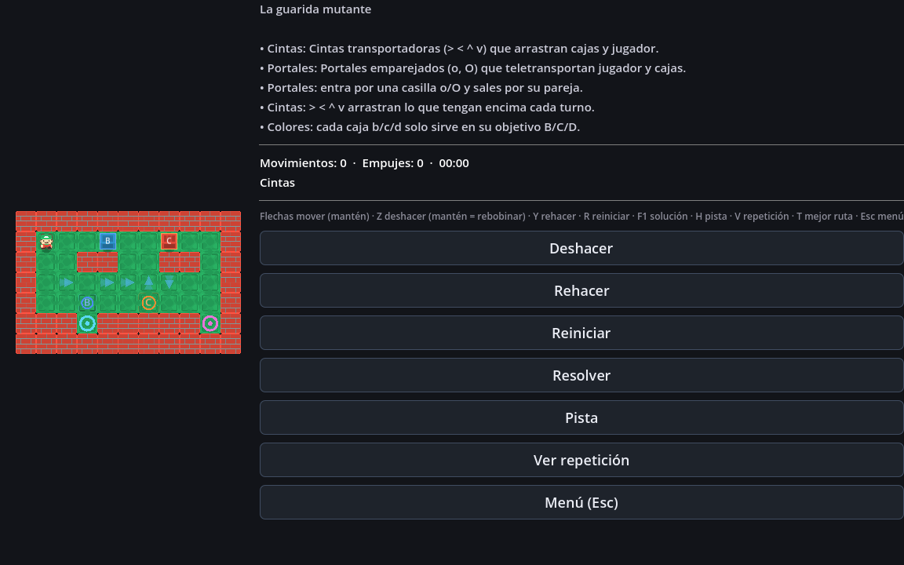
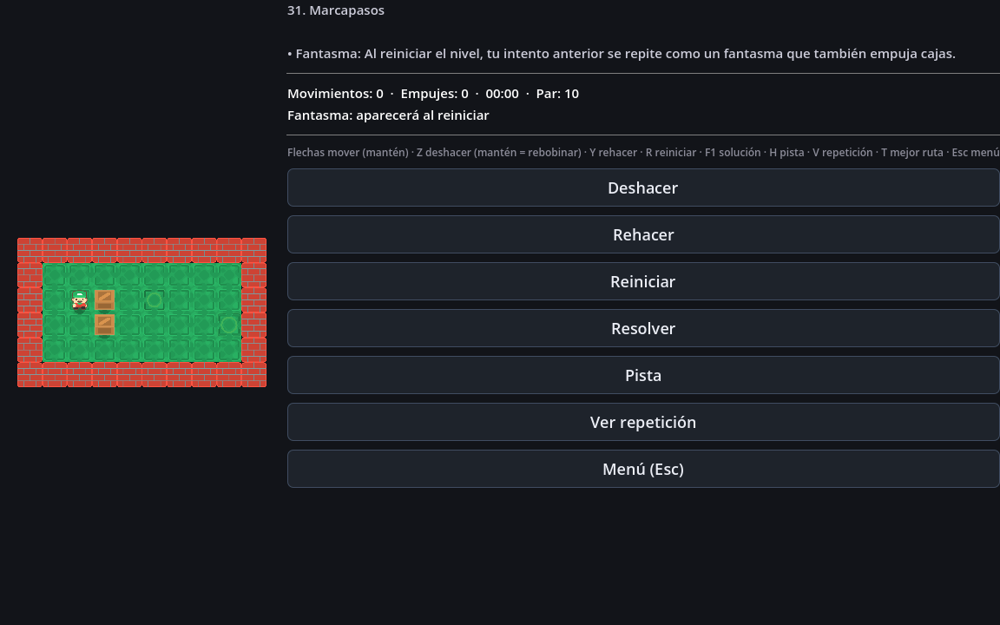
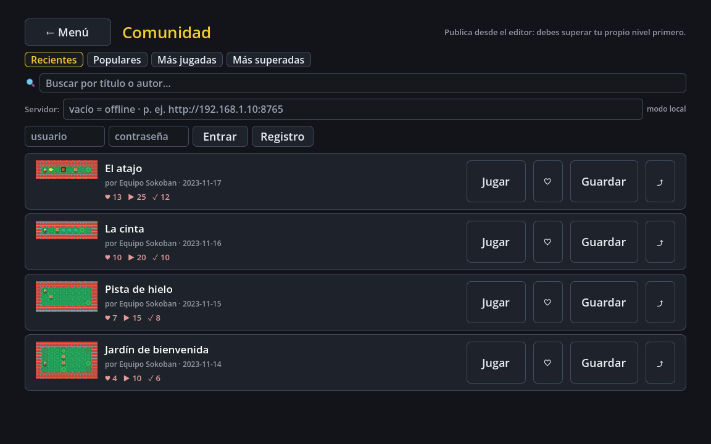
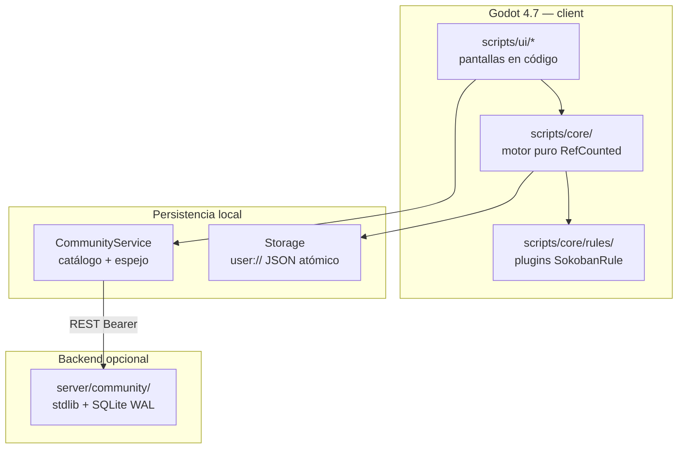

# Sokoban Mutante

Sokoban donde cada nivel introduce una regla absurda — con editor de niveles,
solver, campaña de 81 niveles mutantes + 155 clásicos Microban, y un
Modo Comunidad estilo Mario Maker con backend autoalojable.

[](https://github.com/alesanfe/sokoban-godot/actions/workflows/ci.yml)


📖 [Arquitectura](docs/ARCHITECTURE.md) ·
[Reglas](docs/RULES.md) ·
[API](docs/API.md) ·
[Operación](docs/OPERATIONS.md) ·
[Contribuir](CONTRIBUTING.md) ·
[Seguridad](SECURITY.md) ·
[Changelog](CHANGELOG.md)

## Galería

<table>
  <tr>
    <td></td>
    <td></td>
  </tr>
  <tr>
    <td></td>
    <td></td>
  </tr>
</table>

*Las capturas se regeneran con `godot --path . -s res://tools/screenshots.gd`.*

## Para el jugador

| | |
|---|---|
| **Jugar ya** | `godot --path .` o abre el proyecto en el editor y pulsa **F5** |
| **Desafío diario** | nivel nuevo cada día, con racha |
| **Compartir** | código `SKM1.…` al portapapeles — funciona sin internet |
| **Editor** | 46 tiles, Ctrl+Z/Y, "Probar" y "Verificar" con solver en worker |

## Para el que mira el código

| | |
|---|---|
| **Motor puro** | `RefCounted`, sin SceneTree — 227 checks headless en segundos |
| **Reglas = plugins** | un archivo por regla, hooks declarativos |
| **Backend opcional** | Python stdlib + SQLite WAL, self-hosted |
| **Un comando lo verifica** | `tools/test_all.ps1` — motor + UI + backend + lint |

## Inicio rápido

```bash
git clone https://github.com/alesanfe/sokoban-godot.git
cd sokoban-godot
godot --path .            # jugar (o F5 en el editor)
```

Para contribuir:

```bash
tools/test_all.ps1        # Windows — todas las suites + backend
tools/test_all.sh         # bash equivalente
```

**Salida esperada**: `== 227 checks, 0 failures ==` y `== UI smoke: 0 failures ==`.

## Qué lo hace mutante

Cada regla es un `SokobanRule` con hooks (`can_push`, `resolve_push`,
`after_player_move`, `on_tick`…) — y cada nivel puede combinarlas con
parámetros del editor:

- **Espacio**: gravedad, toro, portales, cintas, viento, terremoto
- **Tiempo**: rotación del tablero, sillas musicales, Juego de la Vida
- **Cajas**: mímicas, rodantes, pesadas, de color, cadena, mitosis
- **Jugador**: vértigo, controles invertidos, arrastre, muelle, dos jugadores
- **Puerta de atrás**: interruptores `!`, paredes tímidas `?`, bombas `x`,
  llaves, raíles, sumideros, filtros de color — 46 tiles especiales

📚 **Referencia completa**: [docs/RULES.md](docs/RULES.md)

## Contenido

- **81 niveles de campaña** que introducen y combinan cada regla
- **155 niveles clásicos** del pack Microban (formato XSB)
- **Desafío diario** con seed por fecha — mismo nivel para todos
- **Editor integrado** con test-play, solver, dificultad y exportación SKM
- **Modo Comunidad**: publica solo lo que tú mismo has superado;
  backend autoalojable con cuentas Bearer, feed paginado y moderación

## Arquitectura



El motor nunca toca SceneTree — el solver y el generador corren en
`WorkerThreadPool` sin congelar la UI. Reglas y niveles serializan a
JSON; los códigos `SKM1`/`SKM2` son texto portable.

Detalles: [docs/ARCHITECTURE.md](docs/ARCHITECTURE.md) ·
decisiones: [docs/decisions/](docs/decisions/)

## Testing

```bash
godot --headless --path . -s res://tests/test_runner.gd   # 227 checks motor+campaña
godot --headless --path . -s res://tests/test_ui.gd       # UI + comunidad E2E
python server/test_routes.py                              # backend sin socket
python server/test_load.py                                # 250 reqs concurrencia
python -m ruff check server/                              # lint Python
python -m bandit -r server/                               # seguridad Python
```

`tools/test_all.ps1` corre todo lo anterior y gdlint.

## Requisitos

| Para | Necesitas |
|---|---|
| Jugar | Godot 4.7+ (sin Steam — binario único) |
| Contribuir | Python 3.10+, ruff/bandit opcional |
| Backend | Python 3.10+ — cero dependencias externas |

## Estructura

```
sokoban-godot/
├── scripts/core/      motor determinista, reglas, solver, storage
├── scripts/ui/        pantallas construidas en código
├── server/community/  backend (paquete: config·store·auth·routes…)
├── tests/             runners headless — todo sin SceneTree
├── docs/              requisitos, arquitectura, API, ADRs, operación
└── tools/             test_all, audit_levels, release
```

## Estado del proyecto

> [!NOTE]
> **v1.1.0** — estable y jugable. El backend de comunidad es
> self-hosted (LAN/amigos); no hay instancia pública central.

## Soporte

- Bugs → [issues](https://github.com/alesanfe/sokoban-godot/issues)
- Seguridad → [SECURITY.md](SECURITY.md) (privado, no issue público)
- Contribuir → [CONTRIBUTING.md](CONTRIBUTING.md)

## Licencia

[MIT](LICENSE). Sprites [Kenney Sokoban](https://kenney.nl) — CC0.
Nivel pack Microban © David W. Skinner.
